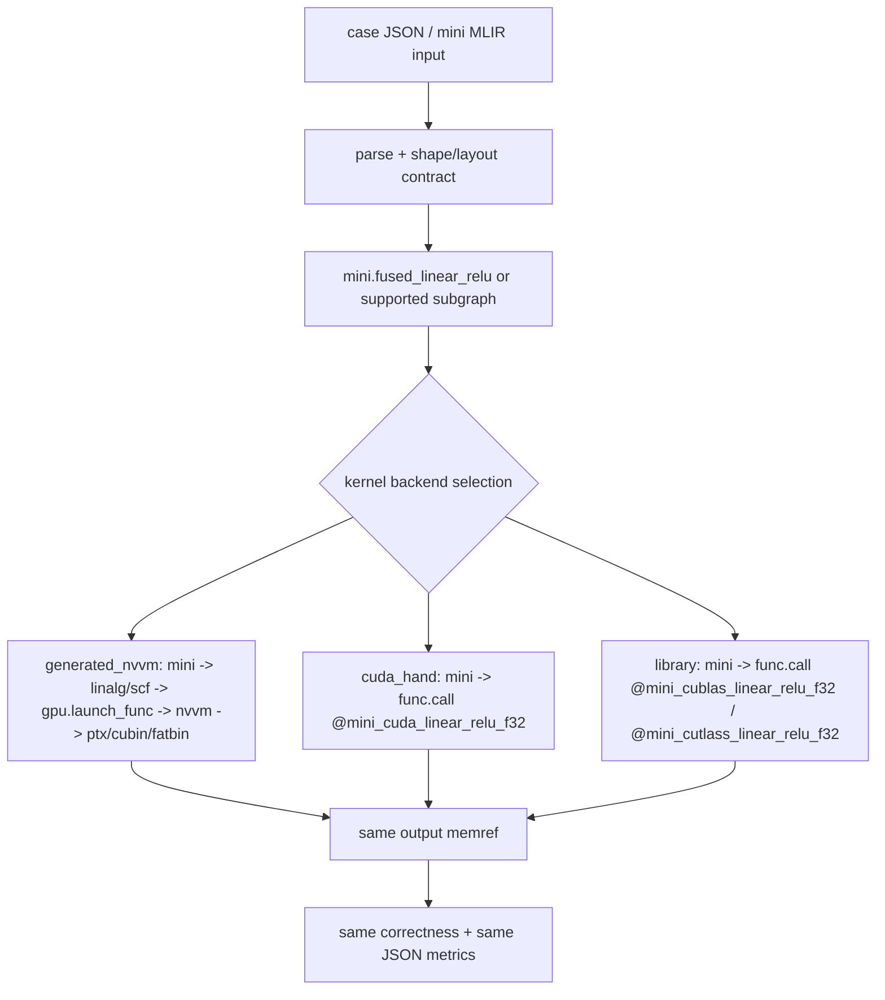

# compiler-mlir GPU 性能监控方案

本文记录 `compiler-mlir` GPU 路线的性能监控工程。当前目标不是追求完整工业级 benchmark，而是把同一个 case 在编译器生成 kernel、手写 CUDA kernel、第三方库 backend 之间做可重复对照，并把运行结果和 Nsight 报告落盘到仓库中，便于后续在其他机器上直接查看。

新的设计结论是：默认性能对比必须比较三条路线最终 kernel 的 steady-state 运行时间，即 `kernel_ms`，不把 MLIR lowering、PTX/cubin/fatbin 生成、JIT engine 创建、输入构造、显存分配、H2D/D2H 拷贝等前置或收尾阶段计入主指标。这些阶段仍然保留为辅助指标，用于分析编译器系统开销。

## 新方案总览

性能监控体系采用“双基线 + 三路线”的结构：

- **编译器集成基线**：同一个 `mini` IR / MLIR case 进入同一个 runner，由编译器在算子或子图级别选择 backend，分别走自动生成 kernel、手写 CUDA runtime call、第三方库 runtime call。它是最终用于公平横向对比的主路线。
- **独立 kernel 微基线**：保留 `mini-compiler-kernel-bench` 或单独 CUDA 程序，用最短路径迭代手写 CUDA / cuBLAS / CUTLASS kernel。它用于快速定位 kernel 内部瓶颈，再把成熟实现接回编译器集成基线。

三条对比路线是：

- `generated_nvvm` / `mlir_nvvm`：`mini` op 由 MLIR 自动 lowering 到 `gpu` / `nvvm`，再生成 PTX、cubin 或 fatbin，并通过 MLIR GPU runtime 执行。
- `cuda_hand`：`mini` op 不继续 lower 成自动 kernel，而是在 backend selection 之后 lower 成外部 runtime call，例如 `@mini_cuda_linear_relu_f32`，由预编译手写 CUDA kernel 执行。
- `cublas` / `cutlass`：`mini` op lower 成外部库 runtime call，例如 `@mini_cublas_linear_relu_f32` 或 `@mini_cutlass_linear_relu_f32`，由第三方库 kernel 执行。

核心约束：

- 三条路线共享同一个 case 描述、shape、dtype、layout、初始化数据、输出 buffer 和 correctness 检查。
- 分叉点固定在高层 op 或融合子图，例如 `mini.fused_linear_relu`，不能让不同路线各自拥有不同的数据准备逻辑。
- 默认对比指标是 `kernel_ms.median`；`invoke_ms`、`compile_ms`、`prepare_ms`、`end_to_end_ms` 只作为辅助列展示。
- Nsight Systems 用 NVTX range 看阶段拆分；Nsight Compute 用 kernel name / NVTX filter 看具体 kernel 内部瓶颈。
- 当前仓库已有结果属于 v0 工程快照，能证明 harness 和 profiling 链路可用，但还不是最终公平的 pure-kernel 对比。

## 双基线职责

| 基线 | 入口 | 主要用途 | 对比结论能回答什么 |
| --- | --- | --- | --- |
| 编译器集成基线 | `mini-compiler-gpu-runner` + `perf_run.py` | 同一个编译器调用路径下比较三类 backend | 编译器自动生成 kernel、手写 CUDA kernel、库 kernel 在同一运行协议下谁更快 |
| 独立 kernel 微基线 | `mini-compiler-kernel-bench` / standalone CUDA | 快速调试手写 kernel、库调用参数、Nsight Compute 指标 | 某个 kernel 实现本身是否接近合理性能上限 |

两条基线不互相替代：

- 如果只看独立 CUDA 程序，容易忽略编译器 runtime ABI、memref layout、stream、workspace、correctness 等集成成本。
- 如果只看编译器 runner，调试 kernel 内部 mapping 会慢，尤其是手写 CUDA / CUTLASS tile 参数还在试验阶段。
- 因此优化顺序建议是：先用独立微基线把 kernel 做到可解释，再接入编译器集成基线做最终横向对比。

## 统一编译器调用模型

目标路线如下：



推荐新增或演进的编译器开关：

```bash
./build/bin/mini-compiler-gpu-runner test/linear_relu.mlir \
  --kernel-backend=generated_nvvm \
  --warmup=10 \
  --repeat=50 \
  --json-output=perf/runs/linear_relu_generated_nvvm.json

./build/bin/mini-compiler-gpu-runner test/linear_relu.mlir \
  --kernel-backend=cuda_hand \
  --warmup=10 \
  --repeat=50 \
  --json-output=perf/runs/linear_relu_cuda_hand_integrated.json

./build/bin/mini-compiler-gpu-runner test/linear_relu.mlir \
  --kernel-backend=cublas \
  --warmup=10 \
  --repeat=50 \
  --json-output=perf/runs/linear_relu_cublas_integrated.json
```

`perf_run.py` 目标上只负责调度这些统一 runner 命令：

```bash
python3 ./scripts/perf_run.py perf/cases/linear_relu_f32_m1024_n1024_k1024.json \
  --mode compiler-integrated \
  --backend generated_nvvm \
  --backend cuda_hand \
  --backend cublas \
  --metric kernel_ms \
  --warmup 10 \
  --repeat 50 \
  --run-dir perf/runs/linear_relu_integrated_a10
```

上面命令中 `generated_nvvm` 当前已经走 `mini-compiler-gpu-runner`，并通过 CUDA runtime perf hooks 输出 `metrics.kernel_ms`。`cuda_hand` / `cublas` 也已接入同一个 runner 的 backend selection 入口：runner 使用 case problem 描述准备同一组 device buffer，再调用 `MiniCudaKernelRuntime.cu` 中的 runtime ABI 并回收 `kernel_ms`。`cutlass` 仍保留为稳定接口，等待后续实现。

## 输入、输出与分叉点

| 阶段 | 是否共享 | 输入 | 输出 | 说明 |
| --- | --- | --- | --- | --- |
| case 加载 | 共享 | `perf/cases/*.json` | op、shape、dtype、backend 列表 | 只描述问题规模和期望路线，不放路线私有预处理 |
| MLIR 输入 | 共享 | `test/*.mlir` 或由 case 指向的 MLIR | `mini` dialect module | 三路线从同一个高层语义出发 |
| 数据初始化 | 共享 | `data_profile`、shape、dtype | host reference input | deterministic profile 必须跨路线一致 |
| buffer 准备 | 共享 | host input / weights / bias | device input / output memrefs | 默认不计入 `kernel_ms` |
| backend selection | 分叉 | `mini.fused_linear_relu` 或支持的子图 | generated / hand / library lowering | 唯一允许改变执行实现的地方 |
| kernel 执行 | 分叉 | 相同 device memrefs、shape 参数、stream | 同一个 output memref | `kernel_ms` 只覆盖这里 |
| correctness | 共享 | output memref / reference | `correct`、误差指标 | 后续应从首元素扩展到 full-output max error |
| JSON 汇总 | 共享 | per-backend metrics | `summary.json` | `perf_compare.py` 默认按 `kernel_ms` 排序 |

### 分叉设计

`mini.fused_linear_relu` 是当前最合适的第一分叉点：

- 自动生成路线：继续走现有 `mini -> gpu -> nvvm` lowering，生成 `gpu.launch_func`，最终由 MLIR GPU runtime 调 `mgpuLaunchKernel`。
- 手写 CUDA 路线：在 `mini` 或 bufferized memref 层 lower 成 `func.call @mini_cuda_linear_relu_f32`，runtime wrapper 内部 launch `linearReluKernel<<<...>>>`。
- 库路线：lower 成 `func.call @mini_cublas_linear_relu_f32` 或 `@mini_cutlass_linear_relu_f32`，runtime wrapper 内部调用 cuBLAS / CUTLASS，再按需要执行 epilogue kernel。

后续可以把同样模型扩展到更大的子图，例如 `matmul + bias + relu`、attention block 中的局部 pattern，但第一阶段不要跳过 `linear_relu`，因为它足够小，方便对齐 correctness、timing 和 Nsight 名称。

## Runtime ABI 设计

目标 ABI 要满足三点：同一份 device buffer、同一个 stream、同一套 timing 记录。

建议先定义最小 C ABI：

```c
extern "C" void mini_cuda_linear_relu_f32(
    void *input,
    void *weight,
    void *bias,
    void *output,
    int64_t m,
    int64_t n,
    int64_t k,
    void *stream,
    void *perf_context);

extern "C" void mini_cublas_linear_relu_f32(
    void *input,
    void *weight,
    void *bias,
    void *output,
    int64_t m,
    int64_t n,
    int64_t k,
    void *stream,
    void *perf_context);
```

落地时可以根据 MLIR lowering 阶段选择参数形态：

- 如果 call 发生在 memref descriptor 仍可见的阶段，runtime wrapper 接收 `StridedMemRefType<float, 2>*`，再取出 device pointer、sizes、strides。
- 如果 call 发生在更低层 LLVM ABI，runtime wrapper 接收扁平 device pointer 和显式 shape。
- 第一阶段可以由 wrapper 使用 runtime-owned stream；最终应与 generated route 使用同一 stream contract，避免 stream 同步差异影响对比。
- cuBLAS / CUTLASS handle、workspace、algorithm selection 应在 prepare 或 warmup 阶段完成，不计入 `kernel_ms`。

## 指标体系

默认 JSON schema 应演进为：

```json
{
  "backend": "generated_nvvm",
  "kind": "compiler_integrated",
  "measurement_contract": {
    "default_compare_metric": "kernel_ms",
    "excluded_from_kernel_ms": [
      "mlir_parse",
      "lowering",
      "ptx_or_cubin_generation",
      "execution_engine_create",
      "module_load",
      "input_initialization",
      "allocation",
      "h2d",
      "d2h",
      "correctness"
    ]
  },
  "metrics": {
    "kernel_ms": {
      "source": "cuda_event",
      "min": 0.0,
      "mean": 0.0,
      "median": 0.0,
      "max": 0.0,
      "timings_ms": []
    },
    "invoke_ms": {
      "source": "host_steady_clock",
      "min": 0.0,
      "mean": 0.0,
      "median": 0.0,
      "max": 0.0
    },
    "compile_ms": 0.0,
    "engine_create_ms": 0.0,
    "prepare_ms": 0.0,
    "end_to_end_ms": 0.0
  }
}
```

各指标含义：

- `kernel_ms`：主指标。用 CUDA event / driver event 记录 steady-state kernel 或 kernel sequence 的 GPU elapsed time。
- `invoke_ms`：host 侧一次 `engine.invoke` 或 runtime call 的 wall time，可用于看 launch、wrapper、同步开销。
- `compile_ms`：MLIR parse + pass pipeline + PTX/cubin/fatbin 生成耗时。
- `engine_create_ms`：ExecutionEngine / JIT 创建耗时。
- `prepare_ms`：输入构造、显存分配、H2D、handle/workspace 初始化耗时。
- `end_to_end_ms`：完整流程耗时，用于系统体验分析，不用于 kernel 性能排名。

`perf_compare.py` 的目标行为：

- 默认按 `metrics.kernel_ms.median` 排序和计算 gap。
- 如果某个 backend 没有 `kernel_ms`，显式标记 `metric_missing`，不得静默退化成 `latency_ms` 后继续声称公平比较。
- 支持 `--metric kernel_ms|invoke_ms|end_to_end_ms`，让系统开销分析和 kernel 分析分开进行。

## CUDA event 与 NVTX 采集

### CUDA event timing

推荐分两层采集：

- `mini-compiler-gpu-runner` 在 warmup 后进入 benchmark loop，负责 reset per-iteration perf context。
- runtime wrapper 在真正 launch kernel 或 library call 的地方记录 CUDA event，并把 elapsed time 写回 perf accumulator。

对三条路线的采集位置：

- `generated_nvvm`：在 `mgpuLaunchKernel` 内围绕 `cuLaunchKernel` 记录 event；单 kernel op 直接得到该 kernel 的 GPU 时间，多 kernel graph 可以按 kernel 名称和 op name 聚合。
- `cuda_hand`：在 `mini_cuda_linear_relu_f32` 内围绕手写 kernel launch 记录 event。
- `cublas` / `cutlass`：在 `mini_cublas_linear_relu_f32` / `mini_cutlass_linear_relu_f32` 内围绕库调用和必要 epilogue kernel 记录 event；如果一个 op 对应多个 kernel，`kernel_ms` 表示该 op 的 GPU sequence 时间，细粒度 kernel 时间交给 Nsight Compute。

第一版可以用 event stop 后同步来获得精确 elapsed time；后续如果同步扰动过大，再改为记录 event pair，iteration 末尾统一 synchronize 和 collect。

### NVTX range 命名

建议统一命名：

- 阶段级：`compile`、`engine_create`、`prepare_inputs`、`warmup`、`benchmark`、`verify`
- backend 级：`backend/generated_nvvm`、`backend/cuda_hand`、`backend/cublas`、`backend/cutlass`
- kernel/op 级：`op/linear_relu/generated_nvvm`、`op/linear_relu/cuda_hand`、`op/linear_relu/cublas`
- 低层 wrapper：`module_load`、`kernel_launch`、`memcpy_h2d`、`memcpy_d2h`

这样 Nsight Systems 可以直接回答“时间花在编译、准备、launch、memcpy、kernel 还是验证”，Nsight Compute 可以再深入具体 kernel 的 occupancy、memory throughput、stall reason。

## Nsight 支持范围

三类 kernel 都可以被 Nsight 分析，但关注点不同：

- 自动生成 kernel：Nsight 能看到 MLIR GPU runtime 通过 CUDA driver API 加载并 launch 的 kernel。为了让报告可读，`gpu.func` / kernel symbol 名称要稳定，必要时 dump PTX、cubin、fatbin、lowered MLIR 作为关联 artifact。
- 手写 CUDA kernel：Nsight Compute 可以直接按 `linearReluKernel` 等 `__global__` 名称过滤，是最适合快速看 occupancy、memory coalescing、register pressure 的路线。
- 第三方库 kernel：Nsight 能看到 cuBLAS / CUTLASS 内部 kernel，但 cuBLAS kernel 名称可能随 CUDA 版本变化；对 cuBLAS 重点看整体 op sequence 时间，对 CUTLASS 可保留更稳定的 template/kernel 名称。

PTX、cubin、fatbin 与 profiling 的关系：

- PTX 是虚拟 ISA，运行前仍会 JIT 或 ptxas 成实际 SASS；Nsight 最终分析的是设备上执行的 kernel。
- cubin / fatbin 已包含面向目标架构的机器码或多架构包，适合减少 JIT 变量并提高复现实验稳定性。
- 对性能对比，推荐云 GPU 正式跑使用 `fatbin` 或明确 `sm_86` cubin；调试 lowering 时再 dump PTX 阅读生成质量。

## 当前实现状态

### v0 已落地目标

当前已落地的性能监控 harness 可以比较三类 backend：

- `mlir_nvvm`：由 `mini-compiler-gpu-runner` 走 `mini -> gpu -> nvvm -> fatbin -> ExecutionEngine` 的编译器生成路线
- `cuda_hand`：手写 CUDA kernel baseline
- `cublas`：cuBLAS SGEMM 加 CUDA bias/ReLU epilogue 的库 baseline

但这里需要明确区分 v0 现状和目标方案：

- 当前 `mlir_nvvm` 是编译器自动 lowering 后由 `mini-compiler-gpu-runner` 执行。
- 当前 `cuda_hand` / `cublas` 已由 `mini-compiler-gpu-runner` 统一调度，并通过 runtime ABI 执行；它们还不是由 `mini.fused_linear_relu` MLIR op lower 成 `func.call`，但已经共享 runner、case problem、buffer 准备、correctness 和 JSON metric 口径。
- 当前 `mlir_nvvm` 的 `latency_ms` 是 benchmark loop 内的 host wall time，主要反映 `engine.invoke` 到返回的耗时，不等同于 pure kernel GPU time。
- 当前 `cuda_hand` / `cublas` 的 `latency_ms` 是 host wall launch-to-stream-sync 时间，已排除 allocation / H2D，但仍不是 CUDA event 口径的 `kernel_ms`。
- 因此当前 A10 归档结果适合验证链路和观察大方向，不应作为最终三路线 kernel 性能公平排名。

对比时统一使用：

- 同一个 case JSON
- 同一套 warmup/repeat 协议
- 同一套 correctness tolerance
- 同一套 JSON 输出格式
- 同一个 `perf_compare.py` 汇总入口

重点回答：

- 编译器生成 kernel 是否正确
- `mlir_nvvm` 和手写 CUDA 的差距
- `mlir_nvvm` 和 cuBLAS 库路线的差距
- 主要瓶颈在 compile、JIT engine、launch、memcpy、kernel execution 还是 wrapper runtime

## 入口文件

核心入口：

- `perf/cases/gpu_runner_demo.json`
  - 小型 demo case
  - 已接入 `mlir_nvvm`、`cuda_hand`、`cublas`
  - 适合 smoke test、Nsight Systems、Nsight Compute
- `perf/cases/linear_relu_f32_m1024_n1024_k1024.json`
  - 大型 `linear + relu` case
  - 已接入 `cuda_hand`、`cublas`
  - 适合观察真实 GPU 吞吐差距
- `scripts/perf_run.py`
  - 统一运行入口
  - 负责调度 backend、写 backend JSON、写 `summary.json`
- `scripts/perf_compare.py`
  - 读取 `summary.json`
  - 输出 correctness、median/mean latency、相对 gap
- `scripts/perf_profile_nsys.sh`
  - Nsight Systems 包装脚本
  - 用于查看 compile、engine_create、warmup、benchmark、module_load、kernel_launch 等 NVTX range
- `scripts/perf_profile_ncu.sh`
  - Nsight Compute 包装脚本
  - 用于查看 kernel 级 occupancy、memory throughput、stall reason 等指标
- `scripts/perf_validate_cloud.sh`
  - 云 GPU 上的一键验证入口
  - 负责 CMake configure/build、运行 `gpu_runner_demo` 三 backend、按 `kernel_ms` 写 `compare_kernel_ms.txt`
- `lib/GpuPasses.cpp`
  - `mini-gpu-runtime-call-lowering`
  - 将静态 shape 的 `mini.fused_linear_relu` 降到 `mini_cuda_linear_relu_f32_memref` / `mini_cublas_linear_relu_f32_memref` 形式的显式 `func.call`
  - 提供 `mini-gpu-runtime-call-lowering-pipeline{backend=cuda_hand|cublas}`，用于降到 LLVM 后执行 runtime-call route
- `test/gpu_runtime_call_lowering.mlir`
  - 验证 `cuda_hand` / `cublas` runtime-call lowering 的 smoke test
- `runtime/MiniCudaKernelRuntime.cu`
  - 提供 runner integrated path 和 executable memref runtime-call path 使用的 CUDA/cuBLAS ABI
- `tools/mini-compiler-runner.cpp`
  - 支持 `--lowering-pipeline=...`，可直接执行 runtime-call lowering pipeline
- `tools/mini-compiler-gpu-runner.cpp`
  - `mlir_nvvm` backend 主入口
- `tools/mini-compiler-kernel-bench.cpp`
  - 外部 CUDA benchmark 主入口
- `tools/KernelBenchCuda.cu`
  - `cuda_hand` 和 `cublas` 的 CUDA 实现

已归档结果入口：

- `perf/runs/gpu_runner_demo_a10_20260511/summary.json`
- `perf/runs/gpu_runner_demo_a10_20260511/compare.txt`
- `perf/runs/linear_relu_f32_m1024_n1024_k1024_a10_20260511/summary.json`
- `perf/runs/linear_relu_f32_m1024_n1024_k1024_a10_20260511/compare.txt`
- `perf/profiles/a10_20260511/gpu_runner_demo_mlir_nvvm_nsys.nsys-rep`
- `perf/profiles/a10_20260511/gpu_runner_demo_mlir_nvvm_nsys_nvtx_summary.txt`
- `perf/profiles/a10_20260511/gpu_runner_demo_cuda_hand_ncu.ncu-rep`
- `perf/profiles/a10_20260511/gpu_runner_demo_cuda_hand_ncu_details.txt`
- `perf/profiles/a10_20260511/gpu_runner_demo_cuda_hand_ncu_session.txt`

## 构建命令

在 A10 云 GPU 环境中使用：

```bash
cmake -S . -B build \
  -G Ninja \
  -DLLVM_DIR=/home/ql/toolchains/llvm_clang_static_analyzer/build/lib/cmake/llvm \
  -DMLIR_DIR=/home/ql/toolchains/llvm_clang_static_analyzer/build/lib/cmake/mlir \
  -DMINI_CUDA_ARCHITECTURES=86
cmake --build build -j2
```

`MINI_CUDA_ARCHITECTURES=86` 对应 NVIDIA A10 的 `sm_86`。

## 运行命令

运行小型 demo 的三 backend 对比：

```bash
./scripts/perf_validate_cloud.sh
```

等价的手动命令：

```bash
python3 ./scripts/perf_run.py perf/cases/gpu_runner_demo.json \
  --backend mlir_nvvm \
  --backend cuda_hand \
  --backend cublas \
  --metric kernel_ms \
  --warmup 10 \
  --repeat 50 \
  --run-dir perf/runs/gpu_runner_demo_a10_20260511
```

查看小型 demo 对比表：

```bash
python3 ./scripts/perf_compare.py \
  --metric latency_ms \
  perf/runs/gpu_runner_demo_a10_20260511/summary.json
```

运行大型 `linear + relu` 的 CUDA/cuBLAS 对比：

```bash
python3 ./scripts/perf_run.py \
  perf/cases/linear_relu_f32_m1024_n1024_k1024.json \
  --metric kernel_ms \
  --warmup 10 \
  --repeat 50 \
  --run-dir perf/runs/linear_relu_f32_m1024_n1024_k1024_a10_20260511
```

查看大型 case 对比表：

```bash
python3 ./scripts/perf_compare.py \
  --metric latency_ms \
  perf/runs/linear_relu_f32_m1024_n1024_k1024_a10_20260511/summary.json
```

直接运行手写 CUDA benchmark：

```bash
./build/bin/mini-compiler-kernel-bench \
  --backend cuda_hand \
  --case perf/cases/gpu_runner_demo.json \
  --warmup 10 \
  --repeat 50 \
  --json-output /tmp/cuda_hand.json
```

直接运行 cuBLAS benchmark：

```bash
./build/bin/mini-compiler-kernel-bench \
  --backend cublas \
  --case perf/cases/linear_relu_f32_m1024_n1024_k1024.json \
  --warmup 10 \
  --repeat 50 \
  --json-output /tmp/cublas.json
```

## Nsight 命令

采集 `mlir_nvvm` 路线的 Nsight Systems 报告：

```bash
./scripts/perf_profile_nsys.sh \
  perf/profiles/a10_20260511/gpu_runner_demo_mlir_nvvm_nsys \
  ./build/bin/mini-compiler-gpu-runner test/gpu_runner_demo.mlir \
    --warmup=1 \
    --repeat=2 \
    --cubin-format=fatbin
```

导出 NVTX 文本摘要：

```bash
nsys stats --force-export=true \
  --report nvtx_pushpop_sum \
  perf/profiles/a10_20260511/gpu_runner_demo_mlir_nvvm_nsys.nsys-rep \
  | tee perf/profiles/a10_20260511/gpu_runner_demo_mlir_nvvm_nsys_nvtx_summary.txt
```

采集手写 CUDA kernel 的 Nsight Compute 报告：

```bash
./scripts/perf_profile_ncu.sh \
  perf/profiles/a10_20260511/gpu_runner_demo_cuda_hand_ncu \
  ./build/bin/mini-compiler-kernel-bench \
    --backend cuda_hand \
    --case perf/cases/gpu_runner_demo.json \
    --warmup 1 \
    --repeat 1
```

导出 Nsight Compute 文本详情：

```bash
ncu --import perf/profiles/a10_20260511/gpu_runner_demo_cuda_hand_ncu.ncu-rep \
  --page details \
  | tee perf/profiles/a10_20260511/gpu_runner_demo_cuda_hand_ncu_details.txt

ncu --import perf/profiles/a10_20260511/gpu_runner_demo_cuda_hand_ncu.ncu-rep \
  --page session \
  | tee perf/profiles/a10_20260511/gpu_runner_demo_cuda_hand_ncu_session.txt
```

如果 `ncu` 报 `ERR_NVGPUCTRPERM`，说明当前用户没有 GPU performance counters 权限。当前机器已通过驱动参数确认：

```bash
grep RmProfilingAdminOnly /proc/driver/nvidia/params
```

期望输出：

```text
RmProfilingAdminOnly: 0
```

## 当前 A10 结果摘要

`gpu_runner_demo` 的归档结果：

```text
case: gpu_runner_demo
baseline: cublas
backend        correct   median ms   mean ms    gap
-------------  --------  ----------  --------  ------
mlir_nvvm      yes            0.479     0.607  40.69x
cuda_hand      yes            0.006     0.006   0.54x
cublas         yes            0.012     0.012   1.00x
```

`linear_relu_f32_m1024_n1024_k1024` 的归档结果：

```text
case: linear_relu_f32_m1024_n1024_k1024
baseline: cublas
backend        correct   median ms   mean ms    gap
-------------  --------  ----------  --------  ------
cuda_hand      yes            5.109     5.109  30.63x
cublas         yes            0.167     0.167   1.00x
```

Nsight Systems 的 NVTX 摘要显示 `mlir_nvvm` 当前主要时间集中在：

- `warmup`
- `module_load`
- `compile`
- `engine_create`
- `benchmark`
- `kernel_launch`

Nsight Compute 的手写 CUDA demo 结论是：小型 demo grid 过小，无法填满 A10 的 72 个 SM，报告中可以看到低 occupancy、低 SM throughput，以及 grid size 太小的优化提示。这符合该 demo 作为 smoke test 的定位；大型 case 更适合作为吞吐性能对比。

## 分阶段落地计划

### Phase 1：对齐指标口径

- 已在 `mini-compiler-kernel-bench` 中增加 CUDA event timing，输出 `metrics.kernel_ms`，并保留 host 侧 `metrics.invoke_ms` 与兼容字段 `latency_ms`。
- 已在 `mini-compiler-gpu-runner` 中增加 `compile_ms`、`engine_create_ms`、`invoke_ms`、`end_to_end_ms` 拆分，避免把 lowering / JIT 时间误读为 kernel 时间。
- 已在 `CudaRuntimeWrappers.cpp` 的 `mgpuLaunchKernel` 中增加 CUDA driver event timing，并通过 runtime perf hooks 回传给 `mini-compiler-gpu-runner`，用于生成 `mlir_nvvm` 的 `metrics.kernel_ms`。
- 已在 `perf_compare.py` 中增加 `--metric`，默认使用 `kernel_ms`；如果缺失则显式提示当前结果不是公平 kernel 对比。
- 本地 CPU-only 环境没有 CUDA runtime wrapper，因此 `mlir_nvvm` 的 `kernel_ms` 需要在云 GPU 上最终验证。

### Phase 2：把手写 CUDA 接进编译器路线

- 已新增 runner 级 backend selection 接口：`--kernel-backend=generated_nvvm|mlir_nvvm|cuda_hand|cublas|cutlass`。当前 `generated_nvvm` / `mlir_nvvm`、`cuda_hand`、`cublas` 可执行；`cutlass` 会返回明确的未实现错误。
- 已新增 CUDA runtime ABI 实现目标：
  - `runtime/MiniCudaKernelRuntime.cu`
  - `mini_cuda_linear_relu_f32`
  - `mini_cublas_linear_relu_f32`
  - 两个 ABI 都会把 CUDA event 计时写入 `CudaRuntimeWrappers.cpp` 的 perf accumulator，供 `mini-compiler-gpu-runner` 汇总 `metrics.kernel_ms`。
- 已在 `mini-compiler-gpu-runner` 中为 `cuda_hand` 接入 integrated runtime path：runner 使用 `--problem-operation/--data-profile/--m/--n/--k` 创建 device buffer，调用 `mini_cuda_linear_relu_f32`，并输出 `kernel_ms`、`invoke_ms`、correctness。
- 已新增 `mini-gpu-runtime-call-lowering{backend=cuda_hand}`，把静态 shape 的 `mini.fused_linear_relu` 降到 `mini_cuda_linear_relu_f32_memref` 形式的显式 `func.call`。
- 已新增 `mini-gpu-runtime-call-lowering-pipeline{backend=cuda_hand}` 和对应 executable memref ABI，可通过 `mini-compiler-runner` 实际执行 runtime-call route。

### Phase 3：把第三方库接进编译器路线

- 已在 `mini-compiler-gpu-runner` 中为 `cublas` 接入 integrated runtime path，调用 `mini_cublas_linear_relu_f32` 并使用同一套 metric schema。
- 已新增 `mini-gpu-runtime-call-lowering{backend=cublas}`，把静态 shape 的 `mini.fused_linear_relu` 降到 `mini_cublas_linear_relu_f32_memref` 形式的显式 `func.call`。
- 已新增 `mini-gpu-runtime-call-lowering-pipeline{backend=cublas}` 和对应 executable memref ABI，可通过 `mini-compiler-runner` 实际执行 runtime-call route。
- 将 cuBLAS handle、workspace、algorithm selection 放到 prepare / warmup，不计入默认 `kernel_ms`。
- 后续接入 CUTLASS 时，优先把 CUTLASS kernel 作为库路线的稳定实现，cuBLAS 作为高质量 vendor baseline。

### Phase 4：统一 Nsight 工作流

- 为所有路线统一 NVTX range 命名，保证 Nsight Systems 能按 backend / op / kernel 分组。
- 为 generated route 保存 lowered MLIR、PTX、cubin/fatbin、kernel symbol name，方便把 Nsight kernel 对回 IR。
- 为 hand / library route 保存 CUDA source、编译架构、cuBLAS/CUTLASS 版本和关键 tile / algorithm 参数。
- 将稳定 profile 的文本摘要归档到 `perf/profiles/`；大型二进制 report 后续可考虑只保留关键样本或迁移到 artifact/LFS。

### Phase 5：优化闭环

- 先用独立微基线优化 hand / library kernel，确认 Nsight Compute 指标合理。
- 再接入编译器集成基线，与 generated route 按 `kernel_ms` 做横向比较。
- 如果 `kernel_ms` 差距大，优先看 mapping、tile、memory access、fusion、vectorization。
- 如果 `kernel_ms` 接近但 `invoke_ms` / `end_to_end_ms` 差距大，再优化 runtime wrapper、module load、allocation、memcpy、JIT cache。

## 后续优化循环

每次优化建议按下面流程执行：

1. 用 `perf_run.py` 跑所有可用 backend，优先使用编译器集成基线。
2. 用 `perf_compare.py --metric kernel_ms` 看 correctness 和 kernel gap。
3. 如果 `kernel_ms` 不合理，用 Nsight Compute 看 occupancy、memory throughput、stall reason、register / shared memory 压力。
4. 如果 `kernel_ms` 接近但 `invoke_ms` 或 `end_to_end_ms` 不合理，用 Nsight Systems 判断瓶颈属于 compile/JIT/runtime/launch/memcpy/verify 哪一类。
5. 修改 lowering、runtime wrapper、kernel mapping、手写 CUDA 或库 backend 配置。
6. 重新跑同一个 case，并确认输入、输出、warmup/repeat、metric 口径没有变化。
7. 将稳定结果保存到 `perf/runs/` 和 `perf/profiles/`。
